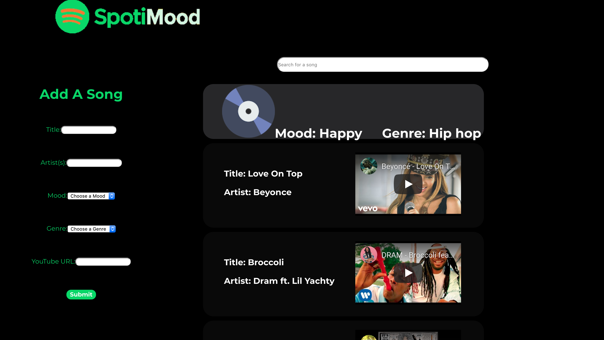

# SpotiMood (Frontend)
---
[BackEnd](https://github.com/cStruong/spotimood_back)

SpotiMood is our Module 4 project where we were first introduced to the React library to build a Single Page Application on a  "virtual" DOM. 

SpotiMood is a web application that allows users to create a playlist that is pre-filled based on their mood and genre preferences whose UI is modeled and inspired by Spotify. Playlist comes with pre-filled songs seeded from a database. Each song card contains song information along with an embedded youtube video.

---

## Tech
SpotiMood was built using React on the frontend as a single page web application while using a backend API built using Ruby on Rails.

---

